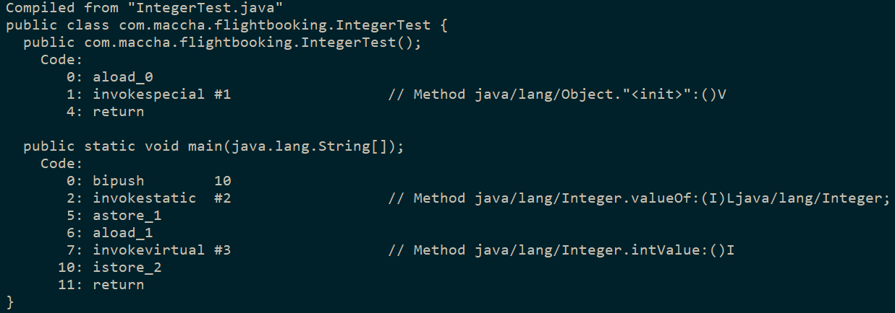

Java中的基本类型都有对应的包装类型，基本类型与其对应的包装类型之间的赋值使用自动装箱与拆箱完成。
自动装箱和拆箱问题是Java中一个能够经常遇到的问题，今天主要先讲述装箱和拆箱的基本内容以及实现原理，另外找了一些面试题中会遇到的与装箱、拆箱相关的问题。
<!--more-->
## 什么是拆箱、什么是装箱?
>**装箱**：基本类型转变为包装器类型的过程。
**拆箱**：包装器类型转变为基本类型的过程。
```Java
Integer x = 2;  //装箱 调用Integer.valueOf(2)
int y = x;      //拆箱 调用x。intValue()
```

Java为每一种基本数据类型都提供了响应的包装器类型，在之前如果想要生成一个数值为50的Interger对象，需要写如下代码：

```Java
Integer i = new Integer(50);
```
但我们知道从Java SE5开始提供自动装箱的特性 上述生成50的Integer对象现在也可以这么写：
```Java
Integer i = 50;
```
这个过程能够自动根据书局创建对应的Integer对象，这是装箱
对应的拆箱、就是自动将包装器类型转换为基本数据类型：

下面是基础数据类型对应的包装器类型：

|  基础类型       |    包装 器类型    |
|   :---:        |       :----:     |
|int(4字节)      |     Integer      |
| byte（1字节）   |     Byte        |
|  short（2字节） |    Short        |
|   long（8字节） |     Long        |
| float（4字节）  |  Float          |
| double（8字节） |  Double         |
| char（2字节）   |  Character      |
| boolean（未定）	| Boolean         |


## 拆箱、装箱具体如何实现
以Integer类为例：
```Java
public class IntegerTest {
    public static void main(String[] args) {
        Integer x = 10;
        int y = x;
    }
}
```
用javap指令反编译class文件之后可见内容如下


从反编译得到的字节码内容可以看出，在装箱的时候自动调用的是Integer的valueOf(int)方法。而在拆箱的时候自动调用的是Integer的intValue方法。

其他类型的拆箱装箱调用方法也类似

因此装箱和拆箱的实现过程可以说：
>装箱过程是通过调用包装器的 **valueOf()** 方法实现的
而拆箱过程是通过调用包装器的 **xxxValue()** 方法实现的
(xxx代表对应的基本数据类型)

## 常见问题
- 整型的包装类 valueOf 方法返回对象时，在常用的取值范围内，会返回缓存对象。
- 浮点型的包装类 valueOf 方法返回新的对象。
- 布尔型的包装类 valueOf 方法 Boolean类的静态常量 TRUE | FALSE。
- 包含算术运算会触发自动拆箱。
- 存在大量自动装箱的过程，如果装箱返回的包装对象不是从缓存中获取，会创建很多新的对象，比较消耗内存。
--------------
**实验代码1：**
```java
public class Main {
    public static void main(String[] args) {

        Integer i1 = 100;
        Integer i2 = 100;
        Integer i3 = 200;
        Integer i4 = 200;

        System.out.println(i1==i2);
        System.out.println(i3==i4);
    }
}
```
上述代码执行会输出什么？结果如下：


```
true
false
```

原因分析：
输出结果表明i1和i2指向的是同一个对象，而i3和i4指向的是不同的对象。
此时来看一下调用的Integer的valueOf方法源码：

```java
public static Integer valueOf(int i) {
        if (i >= IntegerCache.low && i <= IntegerCache.high)
            return IntegerCache.cache[i + (-IntegerCache.low)];
        return new Integer(i);
    }
```

其中IntegerCache类的实现类如下：

```java
private static class IntegerCache {
    static final int low = -128;
    static final int high;
    static final Integer cache[];

    static {
        // high value may be configured by property
        int h = 127;
        String integerCacheHighPropValue =
            sun.misc.VM.getSavedProperty("java.lang.Integer.IntegerCache.high");
        if (integerCacheHighPropValue != null) {
            try {
                int i = parseInt(integerCacheHighPropValue);
                i = Math.max(i, 127);
                // Maximum array size is Integer.MAX_VALUE
                h = Math.min(i, Integer.MAX_VALUE - (-low) -1);
            } catch( NumberFormatException nfe) {
                // If the property cannot be parsed into an int, ignore it.
            }
        }
        high = h;

        cache = new Integer[(high - low) + 1];
        int j = low;
        for(int k = 0; k < cache.length; k++)
            cache[k] = new Integer(j++);

        // range [-128, 127] must be interned (JLS7 5.1.7)
        assert IntegerCache.high >= 127;
    }

    private IntegerCache() {}
}
```

**结论如下：**
>在通过valueOf方法创建Integer对象的时候，如果数值在[-128,127]之间，便返回指向IntegerCache.cache中已经存在的对象的引用；否则创建一个新的Integer对象。
上面的代码中i1和i2的数值为100，因此会直接从cache中取已经存在的对象，所以i1和i2指向的是同一个对象，而i3和i4则是分别指向不同的对象。

----------
**实验代码2：**
```Java       
Double i1 = 100.0;
Double i2 = 100.0;
Double i3 = 200.0;
Double i4 = 200.0;

System.out.println(i1==i2);
System.out.println(i3==i4);
```

```
false
false
```

这是因为Double类的valueOf实现方法返回的是新的对象,在某个范围内的整型数值的个数是有限的，而浮点数却不是.
下面是 **valueOf()** 方法实现：

```java
public static Double valueOf(double d) {
      return new Double(d);
  }
```

>　**注意** :
Integer、Short、Byte、Character、Long这几个类的valueOf方法的实现是类似的.
Double、Float的valueOf方法的实现是类似的。

--------------
**实验代码3：**
```Java
Boolean b1 = false;
Boolean b2 = false;
Boolean b3 = true;
Boolean b4 = true;
System.out.println(b1 == b2);//true
System.out.println(b3 == b4);//true
```

```
true
true
```

同样先看源码方法
下面是 **valueOf()** 方法实现：

```java
public static Boolean valueOf(boolean b) {
    return (b ? TRUE : FALSE);
}
```

其中TRUE和FALSE是在Boolean中定义的两个静态成员属性

```java
  public static final Boolean TRUE = new Boolean(true);

   /**
    * The {@code Boolean} object corresponding to the primitive
    * value {@code false}.
    */
   public static final Boolean FALSE = new Boolean(false);
```

所以输出都是为True

--------------------
**实验代码4：**
```Java
Integer s1 = 0;
long t1 = System.currentTimeMillis();
for(int i = 0; i <1000 * 10000; i++){
    s1 += i;
}
long t2 = System.currentTimeMillis();
System.out.println("使用Integer，递增相加耗时：" + (t2 - t1));//使用Integer，递增相加耗时：114

int s2 = 0;
long t3 = System.currentTimeMillis();
for(int i = 0; i <1000 * 10000; i++){
    s2 += i;
}
long t4 = System.currentTimeMillis();
System.out.println("使用int，递增相加耗时：" + (t4 - t3));//使用int，递增相加耗时：8
```

```java
使用Integer，递增相加耗时：114
使用Integer，递增相加耗时：8
```

原因：在运算中发生了大量的自动装箱拆箱的过程 会消耗内存增加运行时间。

------------------
**实验代码5：**
下面程序输出结果是什么？
```Java
public class Main {
    public static void main(String[] args) {

        Integer a = 1;
        Integer b = 2;
        Integer c = 3;
        Integer d = 3;
        Integer e = 321;
        Integer f = 321;
        Long g = 3L;
        Long h = 2L;

        System.out.println(c==d);
        System.out.println(e==f);
        System.out.println(c==(a+b));
        System.out.println(c.equals(a+b));
        System.out.println(g==(a+b));
        System.out.println(g.equals(a+b));
        System.out.println(g.equals(a+h));
    }
}
```
其中
>当 "=="运算符的两个操作数都是 包装器类型的引用，则是比较指向的是否是同一个对象，
而如果其中有一个操作数是表达式（即包含算术运算）则比较的是数值（即会触发自动拆箱的过程）。
另外，对于包装器类型，equals方法并不会进行类型转换。


```java
true
false
true
true
true
false
true
```

