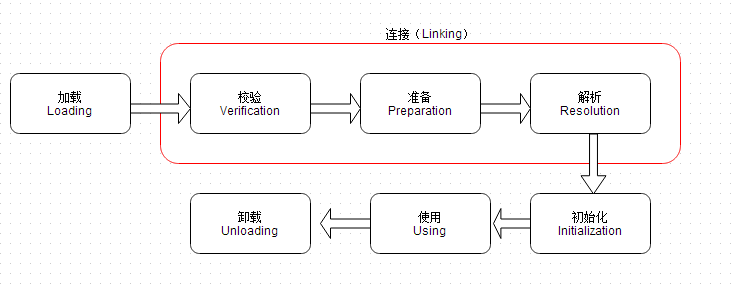

当程序使用到某个类的时候需要把其加载到内存中调用，此时 我们知道系统会通过加载，连接，初始化三个阶段来对该类进行初始化。
而此时进行类的加载过程中有三种方式，本小记对比一下几种方式的差异
<!--more-->
-------------------------------------
## 类加载过程：
   
>**加载：** 用过类的全限定名获取二进制字节流，将二进制字节流转换成方法区中运行的数据结构，在内存中生成类对象
>**连接：**
 校验: 导入类或接口的二进制数据的正确性(文件格式验证，元数据验证，字节码验证，符号引用验证)
 准备: 给类中的静态变量分配空间并初始化数据，
 解析: 将常量池中的符号引用转换成直接引用
 **初始化:** 激活类的静态变量的初始化Java代码和静态Java代码块，并初始化程序员设置的变量值。
## 对类的加载方式
**类加载有三种方式：**
>- 命令行启动应用时候由JVM初始化加载<br>
>
>- 通过Class.forName()方法动态加载<br>
>
>- 通过ClassLoader.loadClass()方法动态加载

下面可以通过一个实例例子查看各个加载方式加载一个含有静态代码块类的输出结果：
```Java
public class CLassLoaderTest {
    public static void main(String[] args) throws ClassNotFoundException {
      ClassLoader loader = Test.class.getClassLoader();
      System.out.println(loader);
      //使用ClassLoader.loadClass()来加载类，不会执行初始化块
      loader.loadClass("Test");
      //使用Class.forName()来加载类，默认会执行初始化块
      Class.forName("Test");
      //使用Class.forName()来加载类，并指定ClassLoader，初始化时不执行静态块
      Class.forName("Test", false, loader);
  }
}
```
加载的类：
```Java
public class Test {
    static {
        System.out.println("静态初始化块执行了");
    }
}
```
输出结果1：

```
sun.misc.Launcher$AppClassLoader@18b4aac2
```

输出结果2：

```
sun.misc.Launcher$AppClassLoader@18b4aac2
静态初始化块执行了
```

输出结果3：

```
sun.misc.Launcher$AppClassLoader@18b4aac2
```


## 加载方式的区别
 Class.forName(className)方法，内部实际调用的方法是  Class.forName(className,true,classloader);

 第2个boolean参数表示类是否需要初始化，  Class.forName(className)默认是需要初始化。一旦初始化，就会触发目标对象的 static块代码执行，static参数也也会被再次初始化。
**源码：**
 ```Java
 @CallerSensitive
     public static Class<?> forName(String name, boolean initialize,
                                    ClassLoader loader)
         throws ClassNotFoundException
     {
         Class<?> caller = null;
         SecurityManager sm = System.getSecurityManager();
         if (sm != null) {
             // Reflective call to get caller class is only needed if a security manager
             // is present.  Avoid the overhead of making this call otherwise.
             caller = Reflection.getCallerClass();
             if (sun.misc.VM.isSystemDomainLoader(loader)) {
                 ClassLoader ccl = ClassLoader.getClassLoader(caller);
                 if (!sun.misc.VM.isSystemDomainLoader(ccl)) {
                     sm.checkPermission(
                         SecurityConstants.GET_CLASSLOADER_PERMISSION);
                 }
             }
         }
         return forName0(name, initialize, loader, caller);
     }
 ```

 ClassLoader.loadClass(className)方法，内部实际调用的方法是  ClassLoader.loadClass(className,false);

 第2个 boolean参数，表示目标对象是否进行链接，false表示不进行链接，由上面介绍可以，不进行链接意味着不进行包括初始化等一系列步骤，那么静态块和静态对象就不会得到执行
**源码：**
 ```java
 public Class<?> loadClass(String name) throws ClassNotFoundException {
       return loadClass(name, false);
   }
 ```
