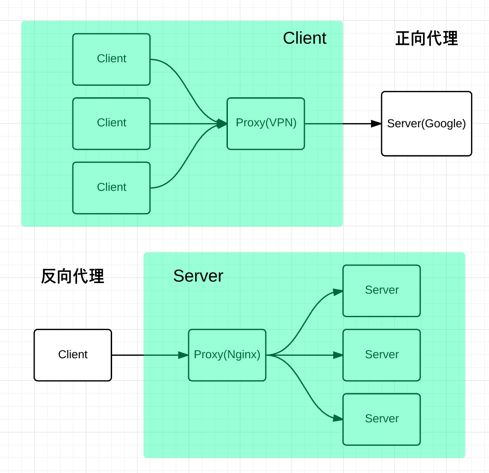

假期重新Review一下各种概念  
这篇博客主要记录下Nginx服务器的用武之地和基本概念
<!-- more -->
## 基础知识
>Nginx是什么

我刚开始接触Web开发的时候没有听过Nginx，说到服务器只知道Apache，其实Nginx和Apache一样都是Web服务器。
Nginx是一个Web服务器并且是一个http服务器 是一个是用C语言开发的基于REST架构风格的http服务器及反向代理服务器，以统一资源描述符(Uniform Resources Identifier)URI或者统一资源定位符(Uniform Resources Locator)URL作为沟通依据，通过HTTP协议提供各种网络服务。
官方测试nginx能够支支撑5万并发链接，并且cpu、内存等资源消耗却非常低，运行非常稳定。   

主要处理客户端和服务端的请求分发
>特点和优势

1.高并发   
2.热部署   
3.快   
4.低功耗   
5.热部署  

## nginx正向代理和反向代理
>为了便于理解，首先先来了解一下一些基础知识，nginx 是一个高性能的反向代理服务器那么什么是反向代理呢？

代理是在服务器和客户端之间假设的一层服务器，代理将接收客户端的请求并将它转发给服务器，然后将服务端的响应转发给客户端。

>正向代理

正向代理（forward）意思是一个位于客户端和原始服务器 (origin server) 之间的服务器，为了从原始服务器取得内容，客户端向代理发送一个请求并指定目标 (原始服务器)，然后代理向原始服务器转交请求并将获得的内容返回给客户端。   

正向代理是为我们服务的，即为客户端服务的，客户端可以根据正向代理访问到它本身无法访问到的服务器资源。   

正向代理对我们是透明的，对服务端是非透明的，即服务端并不知道自己收到的是来自代理的访问还是来自真实客户端的访问。

>反向代理

反向代理（Reverse Proxy）方式是指以代理服务器来接受 internet 上的连接请求，然后将请求转发给内部网络上的服务器，并将从服务器上得到的结果返回给 internet 上请求连接的客户端，此时代理服务器对外就表现为一个反向代理服务器。     

反向代理是为服务端服务的，反向代理可以帮助服务器接收来自客户端的请求，帮助服务器做请求转发，负载均衡等。

反向代理对服务端是透明的，对我们是非透明的，即我们并不知道自己访问的是代理服务器，而服务器知道反向代理在为他服务。

### 为什么要用Nginx
项目中为毛要用nginx服务器代理，不直接用tomcat服务器，还做多了一次接请求？

这个是我想问的，看到很多项目是要用Nginx+tomcat开发的，但是我们知道一般用户命名可以直接访问tomcat，为啥还要用Nginx？这货是个啥玩意？（这是我刚开始疑惑很久的问题）

在一般的Web项目中 并发量小 用户使用的少，所以在低并发的情况下，用户直接访问Tomcat服务器，服务器返回资源消息给用户。   
比如上传个图片并访问图片信息：   

当然我们知道，为了解决并发，可以使用负载均衡：也就是我们多增加几个tomcat服务器。当用户访问的时候，请求可以提交到空闲的tomcat服务器上   
   
但是这种情况下可能会有一种这样的问题：上传图片操作。我们把图片上传到了tomcat1上了，当我们要访问这个图片的时候，tomcat1正好在工作，所以访问的请求就交给其他的tomcat操作，而tomcat之间的数据没有进行同步，所以就发生了我们要请求的图片找不到。

为了解决这种情况，我们就想出了分布式。我们专门建立一个图片服务器，用来存储图片。这样当我们都把图片上传的时候，不管是哪个服务器接收到图片，都把图片上传到图片服务器。

图片服务器上需要安装一个http服务器，可以使用tomcat、apache、nginx。   
   
看到这里大家可能会问，既然我们要选择的是http服务器，为什么不继续使用tomcat，而要使用Nginx？
### Nginx和Tomcat区别
web上的server都叫web server，但是大家分工也有不同的。

>nginx常用做静态内容服务和代理服务器（不是你翻墙那个代理），直面外来请求转发给后面的应用服务（tomcat，django什么的）   
tomcat更多用来做做一个应用容器，让java web app跑在里面的东西，对应同级别的有jboss,jetty等东西。

但是事无绝对，nginx也可以通过模块开发来提供应用功能，tomcat也可以直接提供http服务，通常用在内网和不需要流控等小型服务的场景。

apache用的越来越少了，大体上和nginx功能重合的更多。

严格的来说，Apache/Nginx 应该叫做「HTTP Server」；而 Tomcat 则是一个「Application Server」，或者更准确的来说，是一个「Servlet/JSP」应用的容器（Ruby/Python 等其他语言开发的应用也无法直接运行在 Tomcat 上）。

一个 HTTP Server 关心的是 HTTP 协议层面的传输和访问控制，所以在 Apache/Nginx 上你可以看到代理、负载均衡等功能。客户端通过 HTTP Server 访问服务器上存储的资源（HTML 文件、图片文件等等）。通过 CGI 技术，也可以将处理过的内容通过 HTTP Server 分发，但是一个 HTTP Server 始终只是把服务器上的文件如实的通过 HTTP 协议传输给客户端。

而应用服务器，则是一个应用执行的容器。它首先需要支持开发语言的 Runtime（对于 Tomcat 来说，就是 Java），保证应用能够在应用服务器上正常运行。其次，需要支持应用相关的规范，例如类库、安全方面的特性。对于 Tomcat 来说，就是需要提供 JSP/Sevlet 运行需要的标准类库、Interface 等。为了方便，应用服务器往往也会集成 HTTP Server 的功能，但是不如专业的 HTTP Server 那么强大，所以应用服务器往往是运行在 HTTP Server 的背后，执行应用，将动态的内容转化为静态的内容之后，通过 HTTP Server 分发到客户端。
