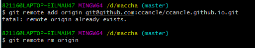
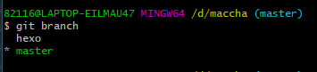
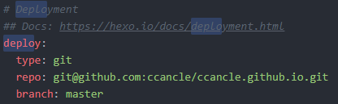
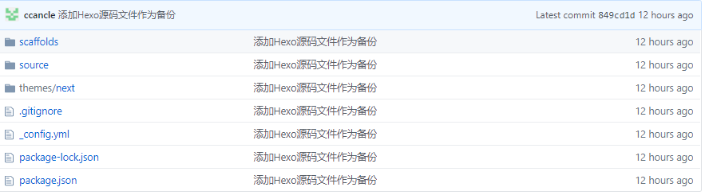

## 一：前言
一开始接触Hexo搭建博客之后，觉得特别好使，尤其是用到的Hexo+Next，个性化东西还是挺丰富的，但是最麻烦的是源文件都是存放在本地的，是用Hexo+Github搭建只是默认把渲染生成的静态网页文件上传到github上，并没有解决Hexo源文件问题。     
我因为坏过一次硬盘，没有备份源文件，相当于白给了导致只能重新搭建博客。   
所以这次搭好博客之后，做的第一件事就是想办法把源文件资源备份下来   
记录手动备份Hexo博客源文件的过程…
<!--more-->
--------

## 二：方法
### 想到的办法两种(其实不就是一种吗)  
* 拷贝到U盘或者移动存储设备中(还用你说？)   
* 把源文件也托管到Github平台上

### Git指令：
* git init //初始化仓库
* git add .(文件name) //添加文件到暂存区
* git commit -m “message” //添加本次提交描述信息
* git remote add origin + url //链接远程仓库，创建主分支
* git pull –rebase origin master // 把本地仓库的变化连接到远程仓库主分支
* git push origin master //把本地仓库的文件推送到远程仓库

## 三：备份
### 新建仓库  
在你的Github中创建一个新的空的repository 取名为 **<font color =#FF4500>(Github用户名)+github.io</font>** (Github Page统一命名)如果博客搭在自己的服务器上那就随便起  

### 创建本地仓库  
打开本地博客文件夹，进入Git bash界面，执行命令创建仓库
```
$ git init
```
### 修改.gitignore文件
一般安装hexo博客的时候会自己带有.gitignore文件   
如果没有请手动创建一个，在里面加入*.log 和 public/ 以及.deploy*/ 。因为每次执行hexo g命令时，上述目录都会被重写更新。因此忽略这两个目录下的文件更新，加快push速度。   
注：如果自带的gitignore文件中有 直接进行下一步：

### 设置远程仓库地址   
如果你之前创建仓库的时候不为空,直接进行添加远程仓库会失败

(勾选了 Initialize this repository with a README这项  需要先删除远程Git仓库:
```
$ git remote rm origin
```
然后添加远程Git仓库（正常为空则可跳过上一个步骤）
```
$ git remote add origin + (你的博客仓库ssh地址或https地址)
```
   
之后创建新的分支hexo 用来存放源文件
```
$ git branch hexo
```
此时有两个分支:

* 默认master用于发布静态网页博客文件
* hexo分支用于存放博客源文件   

（可以查看一下当前分支）:


### 分支管理
**master**   
master分支的文件则需要Hexo进行管理，编辑 **<font color =#FF4500>_config.yml</font>**  站点配置文件，设置branch为master

### 提交Hexo源码
执行以下命令，完成Hexo源文件在本地的提交
```
$ git add .
$ git commit -m "添加Hexo源码文件做备份"
$ git push origin hexo
```
### 将博客静态文件推送到master分支
保证当前还在默认的master分支下(可以git status查看一下当前状态)
```
$ hexo clean   # 如果配置文件没有更改，忽略该命令
$ hexo g -d
```
在github上可以看到hexo分支如下：

master分支仍然是静态博客文件
### 更新
如果之后完成新的博客之后 需要把原本Git仓库中的源文件更新

重复步骤6和7即可 顺序无所谓
## 四：迁移
如果换了电脑继续维护博客或者存储文件损坏   
这时候直接把之前备份过的源文件分支就可以用来恢复了：   
* 安装git   
* 安装Nodejs和npm
* 使用 git clone -b + (博客仓库的HTTPS或者SSH路径) 将仓库拷贝到本地
* 在文件夹中使用:   
   npm install hexo-cli -g   
   npm install deployer-git   
* 等命令安装hexo相关的依赖就可以了

这样就可以做到将hexo博客备份迁移的工作


不过每次发表新的文章还是要更新一下Git中的hexo分支保持同步(养成良好习惯)
## 五：说明
**hexo源文件**
解释一下为什么gitignore文件中忽略那些文件：
```
_config.yml   站点的配置文件，需要拷贝
 themes/      主题文件夹，需要拷贝
source        博客文章的 .md 文件，需要拷贝
scaffolds/    文章的模板，需要拷贝
package.json  安装包的名称，需要拷贝
.gitignore    限定在 push 时哪些文件可以忽略，需要拷贝
.git/         主题和站点都有，标志这是一个 git 项目，不需要拷贝
node_modules/ 是安装包的目录，在执行 npm install 的时候会重新生成，不需要拷贝
public        是 hexo g 生成的静态网页，不需要拷贝
.deploy_git   同上，hexo g 也会生成，不需要拷贝
db.json文件，  不需要拷贝
```
也就是说不需要拷贝的文件就是原本.gitignore文件中忽略的
